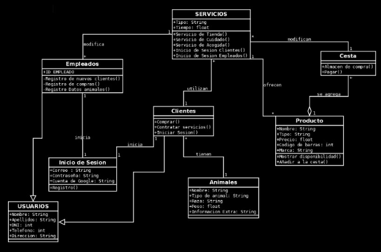

# Aplicación Veterinaria

## Descripción de la Aplicación

La aplicación veterinaria permitirá la gestión de mascotas, clientes y veterinarios. Ofrecerá funcionalidades clave como:

Gestión de historias clínicas.

Registro de citas médicas.

Control de vacunas y tratamientos.

Notificaciones para recordatorios.

Gestión de usuarios y roles.

## Tecnologías a Utilizar

Base de Datos: MongoDB

Backend: NestJS

Frontend: Angular

Contenedorización: Docker

## Roles y Permisos

Administrador: Gestiona usuarios, configuraciones y reportes.

Veterinario: Registra y consulta historias clínicas, agenda citas.

Recepcionista: Programa citas, gestiona pagos y clientes.

Dueño de Mascota: Accede a información de su mascota, recibe recordatorios.

## Requisitos Funcionales

Registro y gestión de usuarios con distintos roles.

Registro de mascotas con datos detallados.

Agenda de citas con notificaciones.

Historial clínico con tratamientos y diagnósticos.

Gestión de vacunas.

Generación de reportes y estadísticas.

Implementación de pagos para consultas y tratamientos.

Notificaciones por correo, SMS o notificaciones móviles.

## Diagramas

Diagrama de Entidad-Relación o UML de Clases (Pendiente de actualización por cambios en la idea).

